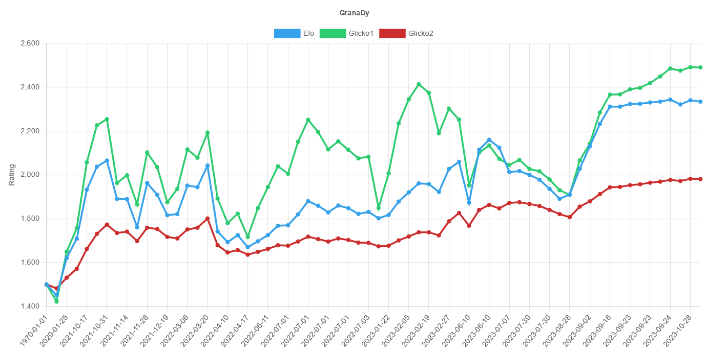

# Trackmania Esports Rating

This project was a mock to see if it would be possible to create a Trackmania esport rating using elo/glicko1/glicko2 rating systems. Neither the scripts, html templates nor data is in any shape or form production ready. Nevertheless, this test was successfull and the conclusion is that a Trackmania esport rating would be possible.

## Pitfalls

### Performance inconsisitency

Players don't necessarily take all tournaments serious and play some for fun with little training resulting in placings below skill level and therefor "ruin" the rating. 

#### Solutions

1. Only use a handful tier 1 tournaments
2. Limit rating gain/loss for tier 2- tournaments differently (not always a solution since even the definition of "tier 1" can have huge differences e.g. see BDSxPringles 3k tournament).

### Multiple player groups

Limited player mixing can result in players "farming" rating while never meeting players from another group. E.g. Elconn manages to gain a lot of rating through tournaments while some TMGL players only focus on TMGL.

#### Solution

1. Only create a rating based on the closed system TMGL/TMCL/TMWT
2. Ignore that issue as this should get smaller with increasing matches -> better rating distribition/exchange

### Missing data

Missing data means that the ratings are inaccurate which is especially 

1. Data of TMGL/TMCL 2023 Stage 2 is missing completely
2. Data of TMGL/TMCL 2023 Stage 1 playoffs is missing
3. Data of TMCL 2023 Stage 1 season is missing
4. TMGL/TMCL Allstar matches are missing
5. TMWT Last chance, TMWT Midstage is missing
6. TMWT regional events (very important for rating replenishment of TMGL/TMCL who mostly play among themselves and only exchange rating with others during Allstar matches, relegation and mid stage)
